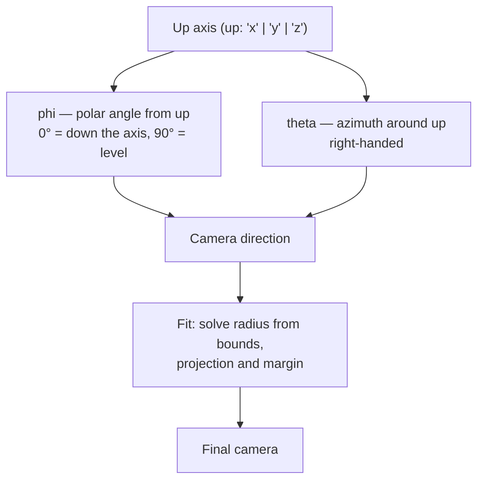

Most renderers ask for a camera position, a target, and an up vector. nanoraster
asks for two angles. That is a deliberate narrowing: a thumbnail's job is to show
a model from a recognisable direction, and every camera that does that job is a
point on a sphere around the subject.

Removing distance from the API also removes a whole class of bad output. A
caller cannot place the camera inside the model, or so far away the subject is a
speck, because the distance is derived rather than supplied.

## How it works

The camera sits on a sphere centred on the model's bounding volume. Two angles
place it, and the radius is solved so the model fills the frame.



`phi` is measured *from* the up axis, so it behaves like colatitude rather than
latitude:

| `phi` | View                            |
| ----: | ------------------------------- |
|   `0` | Straight down the up axis (top) |
|  `60` | Default three-quarter view      |
|  `90` | Level with the model (elevation) |
| `180` | Straight up the up axis (bottom) |

`theta` rotates around the up axis, right-handed. At `phi: 0` the subject is
seen down the axis of rotation, so `theta` only spins the image.

<RenderDemo>

```typescript
import { renderGlbToImage } from 'nanoraster';

const image = await renderGlbToImage(glb, {
  format: 'png',
  up: 'y',
  phi: 60,
  theta: -45,
});
```

</RenderDemo>

### The up axis is the frame of reference

`up` does not rotate the model. It selects which world axis the angles are
measured against, so changing it re-interprets `phi` and `theta` rather than
transforming geometry.

glTF's convention is Y-up, which is the default. CAD exports are frequently
Z-up, which is why `up: 'z'` exists — see
[Frame the model](../guides/frame-the-model).

## Key relationships

**Fitting and margin.** The radius comes from the model's bounds, the requested
aspect ratio, and `margin`. A wide output frames differently from a square one
at the same angles.

**Projection.** `perspective` foreshortens; `orthographic` does not, which makes
two features comparable regardless of depth. That is also what makes the scale
annotation unambiguous — see [Annotate renders](../guides/annotate-renders).

**Batch views.** In `renderGlbToImages`, `phi` and `theta` are per view while
`up`, `projection` and `margin` are shared. That split is what keeps a contact
sheet internally comparable.

## Implications

- **You cannot dolly the camera.** If the subject looks too small, adjust
  `margin`, not a distance.
- **Angles are not portable across up axes.** A view tuned at Y-up needs
  different numbers at Z-up.
- **The fit is deterministic.** The same bounds and the same angles produce the
  same camera, which is a precondition for
  [reproducible output](determinism).
- **Degenerate bounds still render.** A flat or single-point model has a
  degenerate bounding volume; the fit falls back rather than dividing by zero,
  though the result is rarely useful.

## Further reading

- [Frame the model](../guides/frame-the-model) — the practical recipe.
- [Reference: options](../api/options) — exact ranges for every field here.
- [Rendering pipeline](rendering-pipeline) — where fitting sits in the stages.
