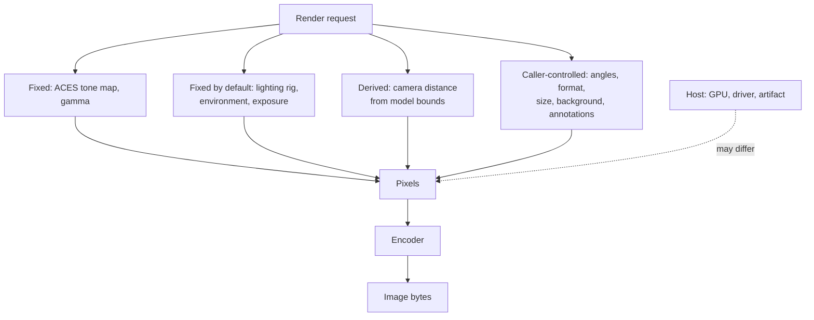

nanoraster's headline claim is that a render is reproducible. That claim is only
useful if its boundaries are stated, because "deterministic" is doing different
work in "the encoder is deterministic" and "this image will be identical on your
machine".

The motivation is that renders are increasingly used as _evidence_ — a CI
artifact that proves a part changed, a screenshot an agent compares across a
tool loop. Evidence that varies for reasons unrelated to the subject is worse
than no evidence, because it invites false conclusions.

## How it works

Determinism comes from removing inputs, not from seeding them. Nothing varies
unless the caller asked for it: values that would otherwise drift are either
fixed outright or fixed at a default the request may override.

The solid edges are the guarantee: given the same request on the same host, each
of those inputs is the same, so the pixels are the same and the encoder produces
the same bytes.

The dashed edge is the exclusion. A different GPU, driver, or render artifact
may rasterise differently at the margins.

### What is guaranteed

| Property                                             | Holds |
| ---------------------------------------------------- | ----- |
| Same request, same host, repeated → identical bytes  | Yes   |
| Same request, same host, different process           | Yes   |
| Lighting identical across every render that omits it | Yes   |
| Camera fit identical for identical bounds and angles | Yes   |
| Input failures reproduce exactly                     | Yes   |

### What is not guaranteed

| Property                                          | Holds | Why                                     |
| ------------------------------------------------- | ----- | --------------------------------------- |
| Identical bytes across different GPUs or drivers  | No    | Rasterisation differs at the margins    |
| Identical bytes between the native and wasm paths | No    | Same core, different device and adapter |
| GPU failures reproduce                            | No    | Device loss is by definition transient  |
| Byte stability across nanoraster versions         | No    | A render fix changes pixels             |

## Key relationships

**Lighting fixed by default.** Determinism is a property of a fixed input, not
of an absent option. Omit `lighting` and every render uses the same studio rig,
so comparisons across a set keep meaning what they meant. Supply a rig and you
inherit the obligation the package holds by default: keep it constant, and the
pixels stay fixed. See [Material model](material-model) and
[Light the subject](../guides/light-the-subject).

**Derived camera distance.** Distance is solved from bounds rather than
supplied, so two renders of the same model at the same angles frame identically
without the caller keeping a number in sync. See [Camera model](camera-model).

**Failure classes.** The split between input failures and GPU faults is the same
split as this page's guarantee: input failures are deterministic and reproduce,
GPU faults are not and do not. That is why only one class is worth retrying —
see [Handle render failures](../guides/handle-render-failures).

## Implications

- **Pin the host, not just the request.** For byte-exact comparison in CI, fix
  the runner image as well as the options.
- **Compare within a host, diff across hosts.** Treat cross-host differences as
  expected, and compare perceptually rather than by hash.
- **Prefer PNG for baselines.** A lossless format makes a diff attributable to
  the render rather than to the encoder.
- **Treat a version bump as a baseline reset.** A rendering fix is a visible
  change by design.
- **Holding the lighting is what makes material edits legible.** With one
  variable removed — by leaving `lighting` out, or by pinning a rig of your own
  — a difference between two renders is the difference you made.

## Further reading

- [Rendering pipeline](rendering-pipeline) — the stages this guarantee covers.
- [Choose a format and quality](../guides/choose-format-and-quality) — encoder
  choices for reproducible baselines.
- [Render a view sheet](../getting-started/render-a-view-sheet) — a worked
  example whose output is stable across runs.
