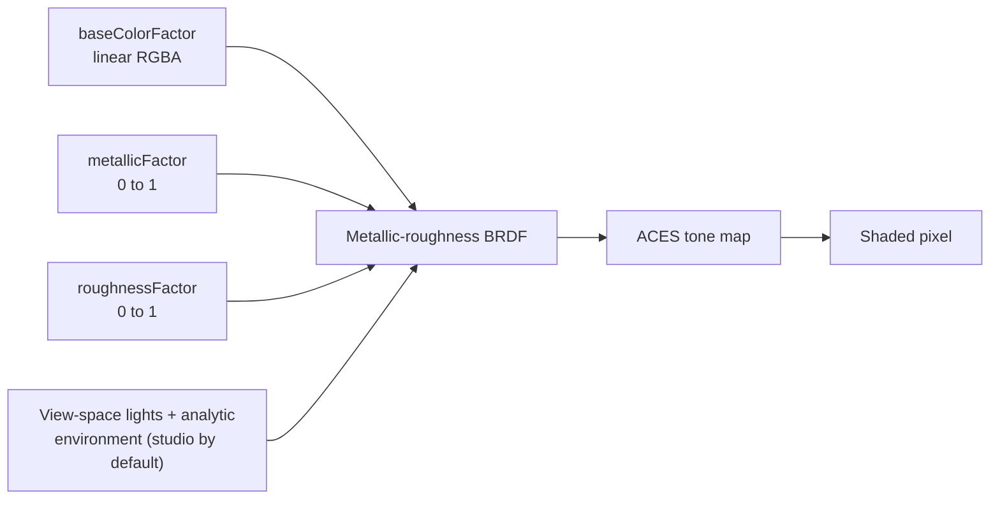

nanoraster renders factor-only glTF 2.0 metallic-roughness materials. A material
is three numbers and a colour, not an image.

That restriction is what lets a render be reproduced from the model file alone.
A texture-backed material makes the output depend on decode behaviour, sampler
state, and mip selection — none of which the GLB pins down — so two hosts can
disagree about the same file. Factors have none of those degrees of freedom.

## How it works

Every surface resolves to three inputs, and the shading model turns them into a
colour with whatever rig is in force — the studio preset unless the request says
otherwise.



`metallicFactor` selects between two behaviours rather than blending two looks.
At `0` the surface has a diffuse colour and a white specular highlight. At `1`
there is no diffuse term at all — the body colour is entirely reflected
environment, tinted by the base colour.

`roughnessFactor` spreads the specular lobe. Low values give a tight highlight;
high values smear it into a broad sheen.

The shaded result is tone mapped with the ACES filmic curve and written to an
sRGB target. The curve is fixed and is not an option; the rig feeding it is
[configurable](../guides/light-the-subject).

### Imitating a matcap

A rough dielectric produces the soft, evenly shaded look usually associated with
a neutral matcap:

<RenderDemo>

```json
{
  "pbrMetallicRoughness": {
    "baseColorFactor": [0.2622506575, 0.3277780981, 0.4072402119, 1],
    "metallicFactor": 0,
    "roughnessFactor": 0.85
  }
}
```

</RenderDemo>

The base colour above is the linear-space equivalent of sRGB `#8C9BAB`; most
glTF exporters perform that conversion when given an sRGB value. Keep
`metallicFactor` at `0`, use `roughnessFactor` between `0.8` and `1`, and
replace the colour with the tint you want.

This is an approximation, not pixel parity. A matcap maps view-space normals
directly into an image; PBR derives the result from material, surface, camera,
and lighting. The two agree in feel, not in pixels.

### Lighting the same material

The rig is a request option, so one material can be shown under several. The
model below is metallic; switch `lighting` between the studio preset, a
two-light rig, the environment with no direct lights at all, and a key fixed to
the model in world space.

<RenderDemo>

```typescript
import { renderGlbToImage } from 'nanoraster';

const image = await renderGlbToImage(glb, {
  format: 'png',
  lighting: 'studio',
});
```

</RenderDemo>

A metal reflects the environment and nothing else, so the four looks differ far
more here than they would on a rough dielectric. See
[Light the subject](../guides/light-the-subject) for the rig fields themselves.

## Key relationships

**Lighting is fixed by default.** The same view-space studio lights and analytic
environment are used for every render that leaves `lighting` out. Holding them
is what makes a metallic change visible as a metallic change rather than as a
lighting difference — see [Determinism](determinism) and
[Light the subject](../guides/light-the-subject).

**Metals need an environment.** Because a metal has no diffuse lobe, it would
render black under direct lights alone. The analytic environment is what gives
`metallicFactor: 1` a body colour at all, which is also why
`environment: 'none'` turns a metal nearly black.

**Edges are separate.** Authored edge lines are drawn in their own pass and are
unaffected by the material factors — see
[Rendering pipeline](rendering-pipeline).

## Implications

- **Textures are ignored, not an error.** A texture-backed material falls back
  to its factors. The render succeeds and looks flatter than the authoring tool
  showed.
- **Metals read as grey at small sizes.** With only an analytic environment to
  reflect, a fully metallic subject loses contrast as it shrinks. Prefer a
  dielectric for thumbnails.
- **Colour is linear, not sRGB.** Passing an sRGB triple directly produces a
  washed-out surface. Convert first.
- **Material changes are attributable while the rig is held.** Change one thing
  at a time: with the lighting left at the default, or pinned to a rig of your
  own, a difference between two renders of the same model is a material
  difference and nothing else.

## Further reading

- [Determinism](determinism) — why lighting is fixed by default.
- [Light the subject](../guides/light-the-subject) — replacing the studio rig.
- [Choose a format and quality](../guides/choose-format-and-quality) — how the
  encoder treats the shaded result.
- [Rendering pipeline](rendering-pipeline) — where shading sits in the stages.
