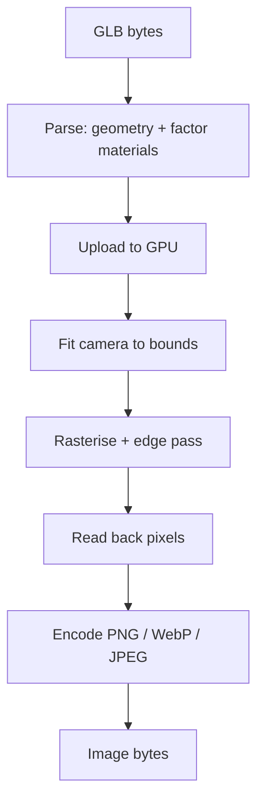
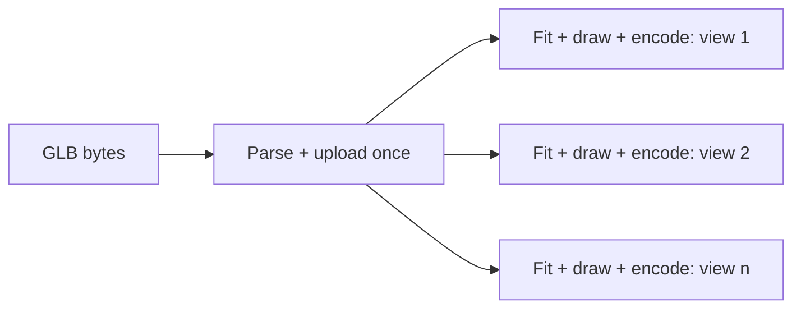

nanoraster exists because two very different hosts — a CI container and a
browser tab — need to produce the *same* image from the same model. Meeting that
goal means the decisions that affect pixels live in one place, and only the
plumbing differs per host.

The package is a thin JavaScript surface over a Rust render core. Everything
that determines what a pixel ends up being happens in that core.

## How it works

A render is four stages. The first and last are CPU work; the middle two are on
the GPU.

**Parse** reads the GLB and rejects anything outside the supported profile. A
failure here is classified `parse`.

**Upload and fit** move the geometry to the device once and compute a camera
that frames the model's bounds using your `phi`, `theta`, `up`, `projection`,
and `margin`. Fitting is derived from the geometry, so you never specify a
camera distance.

**Rasterise** draws the model under fixed lighting, then draws authored edge
lines. Failures here are GPU-class.

**Encode** reads the framebuffer back and compresses it. A request the encoder
cannot represent — a transparent JPEG — fails as `encode`.

### Where the batch call diverges

`renderGlbToImages` runs parse and upload once, then loops the last three
stages per view:

That is the whole reason the batch call exists. Parsing dominates the cost for a
large model, so rendering four views in one call is substantially cheaper than
four separate calls.

## Key relationships

**The two artifacts.** Node.js loads a native N-API binary; browsers load a
WebAssembly module and request a WebGPU adapter. Both wrap the same Rust core
and the same codec implementations, so the stages above are identical. See
[Render in the browser](../guides/render-in-the-browser).

**Ownership.** The GLB you pass in is owned by the call, and the bytes you get
back are owned by you. nanoraster never touches the filesystem; writing the
result is your decision.

**Fixed lighting.** Lighting is not a stage you configure. That is a deliberate
constraint explained in [Determinism](determinism).

## Implications

- **Parse cost is per call, not per view.** Batch when you need several angles.
- **Fitting is automatic and cannot be overridden.** You control direction and
  margin, not distance. See [Frame the model](../guides/frame-the-model).
- **Failures are stage-shaped.** The failure code tells you which stage rejected
  the work, which is what makes the retry decision mechanical rather than a
  guess. See [Handle render failures](../guides/handle-render-failures).
- **Host differences are plumbing, not policy.** A pixel difference between
  hosts is a bug, not a configuration difference.

## Further reading

- [Camera model](camera-model) — the fitting and angle convention in detail.
- [Material model](material-model) — what the parse stage accepts.
- [Reference: operations](../api/operations) — the two entry points.
