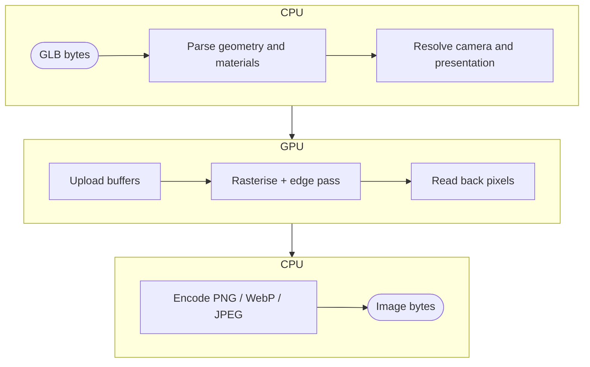

nanoraster is a thin JavaScript surface over a Rust render core. Everything
that decides a pixel's value happens in that core. Only the host integration
differs.

## Pipeline

A render moves CPU → GPU → CPU. Parse and fit run on the CPU. Upload,
rasterise, and read-back run on the GPU. Encode runs on the CPU. Failures carry
the stage name (`parse`, `gpu`, `encode`).



**Parse** reads the GLB and rejects malformed or structurally unsupported
input. A failure here is classified `parse`. The parser does not reject an
out-of-profile _material_. It degrades instead, as the
[material model](#material-model) describes.

**Resolve and upload** settles the camera from eligible referenced indexed
geometry, primitive visibility, and any section caps. It then moves geometry to
the device once. See [Frame the model](guides/frame-the-model),
[Place the camera](guides/place-the-camera), [Choose visible geometry](guides/choose-visible-geometry),
and [Cut section views](guides/render-section-views).

**Rasterise** clips and draws surfaces, section caps, cap outlines, and
authored lines, then applies the requested annotations. Surface lighting uses
the studio preset or supplied rig. Section caps are unlit evidence. Failures
here are GPU-class.

**Encode** compresses the read-back pixels. A request the encoder cannot
represent, such as a transparent JPEG, fails as `encode`. The failure code
names the stage that rejected the work, so the
[retry decision](guides/handle-render-failures) is mechanical, not a guess. With `format: 'raw'` the renderer skips this stage and returns the frame
as read back. See [Work with raw pixels](guides/work-with-raw-pixels).

[`renderImages`](api#renderimages) parses and uploads once, then fits,
rasterises, and encodes once per view. [`RenderTimings`](api#rendertimings)
fields map onto these stages. `parse` covers parse and fit, `capBuild` shared
presentation work, and `upload` source geometry. Each view then
reports `render`, `overlay` for the annotation pass, and `encode`. `setup`
measures the complete acquisition, presentation, and upload interval.

[Both hosts](install), Node.js native and
[browser WebGPU](guides/render-in-the-browser), wrap the same Rust core and
codecs. Only GPU rasterisation differs, so bytes can differ by a shade (see
[Determinism](#determinism)). Any structural difference between hosts is a bug.

## Device lifetime

**State crosses the boundary as handles. Work crosses as plans.** A
[`Renderer`](api#renderer) is the state: the GPU device, shader, pipelines, and
render targets. Its lifetime is the process or worker. A `views` plan is the
work: every requested image in one value. The core can then schedule the next
view's GPU pass while the previous view encodes. A loop over single renders
cannot grant that overlap.

A renderer keeps the device, shader, pipelines, and render targets for the last
output size between calls. Parsing, camera fitting, and geometry upload happen
per call. The one-shot functions run through one shared
renderer per process. The first call creates it, calls run in call order, and
it is never disposed. After each call it drops render targets larger than
2048², so one large render does not hold that memory.

Reuse changes no pixels: it skips re-creation, not arithmetic, so a warm
renderer's output is byte-identical to the one-shot functions on the same
adapter. If the device is lost between calls, the renderer rebuilds it on the
next call. The loss surfaces once, as a GPU-class failure on the call that hit
it.

## Determinism

Renders serve as evidence: a CI artifact that proves a part changed, or a
screenshot an agent compares across a tool loop. Evidence that varies for
reasons unrelated to the subject invites false conclusions. nanoraster
therefore removes inputs rather than seeds them.

Lighting is the studio preset unless the request carries a
[rig](guides/light-the-subject). Tone map and gamma are fixed. Fitted placement
derives from referenced indexed geometry. Camera angles, format, size,
background, and annotations are yours.

What is guaranteed:

- Repeating a request on the same host produces identical bytes, in the same
  or a different process.
- Lighting is identical for every render that states the same `lighting`, or
  none.
- The camera fit is identical for identical referenced geometry and camera inputs.
- Input failures reproduce exactly.

What is not guaranteed:

- Identical bytes across different GPUs or drivers: rasterisation differs at
  the margins.
- Identical bytes between the native and wasm paths: same core, different
  device and adapter.
- GPU failures reproducing: device loss is by definition transient.
- Byte stability across nanoraster versions: a render fix changes pixels, so
  treat a version bump as a baseline reset.

For byte-exact comparison in CI, pin the runner image and the options.
Compare cross-host results perceptually rather than by hash. Any
[lossless format](guides/format-and-annotate) works as a baseline. A
byte-locked baseline also locks the encoder, and a version bump can change
lossless WebP bytes as well as pixels.
[`format: 'raw'`](guides/work-with-raw-pixels) removes the encoder from the
comparison, so a diff can only report the render.

## Material model

nanoraster renders factor-only glTF 2.0 metallic-roughness materials. A
material is three numbers and a colour, not an image. That restriction is the
renderer's supported profile, and it lets a render be reproduced from the model
file alone. A texture-backed material would make the output depend on image
decoding and mip generation. The host supplies those, not the GLB, so two hosts
could disagree about the same file.

`metallicFactor` selects between two behaviours rather than blends two looks.
At `0` the surface has a diffuse colour and a white specular highlight. At `1`
there is no diffuse term: the body colour is reflected environment, tinted by
the base colour. A metal has no diffuse lobe, so only the analytic environment
gives it a body colour. `roughnessFactor` spreads the specular lobe: low values
give a tight highlight, and high values spread it into a broad sheen.

A rough dielectric produces the soft, evenly shaded look usually associated with
a neutral matcap:

<RenderDemo>

```json
{
  "pbrMetallicRoughness": {
    "baseColorFactor": [0.2622506575, 0.3277780981, 0.4072402119, 1],
    "metallicFactor": 0,
    "roughnessFactor": 0.85
  }
}
```

</RenderDemo>

The base colour above is the linear-space equivalent of sRGB `#8C9BAB`. Most
glTF exporters convert an sRGB value for you. An sRGB triple passed directly
gives a washed-out surface. Keep `metallicFactor` at `0`, use `roughnessFactor`
between `0.8` and `1`, and replace the colour with the tint you want. This is
an approximation, not pixel parity. A matcap maps view-space normals into an
image, while PBR derives the result from material, surface, camera, and
lighting.

The renderer ignores a texture-backed material rather than rejects it. It
falls back to its factors, so the render succeeds and looks flatter
than the authoring tool showed. Metals read as grey at small sizes, because
only an analytic environment is there to reflect. Prefer a dielectric for
thumbnails. The renderer draws authored edge lines in their own pass,
unaffected by the material factors. With `lighting` held constant, a difference
between two renders of the same model is a material difference and nothing
else.
