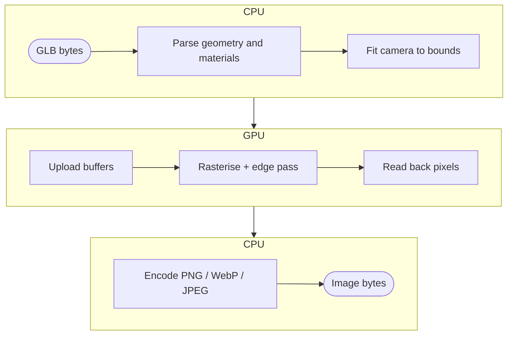

nanoraster is a thin JavaScript surface over a Rust render core. Everything
that decides a pixel's value happens in that core; only the plumbing differs
per host.

## Pipeline

A render moves CPU → GPU → CPU: parse and fit on the CPU,
upload–rasterise–read back on the GPU, encode on the CPU. Failures carry the
stage name (`parse`, `gpu`, `encode`).



**Parse** reads the GLB and rejects malformed or structurally unsupported
input; a failure here is classified `parse`. An out-of-profile *material* is
not rejected — it degrades instead, as the [material model](#material-model)
describes.

**Fit and upload** compute a camera that frames the model's bounds from your
`phi`, `theta`, `up`, `projection` and `margin`, then move the geometry to the
device once; see [Frame the model](guides/frame-the-model).

**Rasterise** draws the model under the studio preset or the rig you supply,
tone maps with the ACES filmic curve, then draws authored edge lines. Failures here are GPU-class.

**Encode** compresses the pixels that came back. A request it cannot
represent, such as a transparent JPEG, fails as `encode`. Because the failure
code names the stage that rejected the work, the
[retry decision](guides/handle-render-failures) is mechanical rather than a
guess.

[`renderGlbToImages`](api#renderglbtoimages) parses and uploads once, then fits,
rasterises and encodes once per view.

[Both hosts](install), Node.js native and
[browser WebGPU](guides/render-in-the-browser), wrap the same Rust core and
codecs. The stages are identical; only GPU rasterisation differs between hosts,
so bytes may differ by a shade (see [Determinism](#determinism)) but any
structural difference between hosts is a bug, not a configuration difference.

## Determinism

Renders are used as evidence: a CI artifact that proves a part changed, a
screenshot an agent compares across a tool loop. Evidence that varies for
reasons unrelated to the subject invites false conclusions, so nanoraster
removes inputs rather than seeding them. Lighting is the studio preset unless
the request carries a [rig](guides/light-the-subject), and then the rig is held
constant like any other input; tone map and gamma are fixed; camera distance is
derived from the model's bounds; angles, format, size, background and
annotations are yours.

What is guaranteed:

- Repeating a request on the same host produces identical bytes, in the same
  process or a different one.
- Lighting is identical for every render that states the same `lighting`, or
  none.
- The camera fit is identical for identical bounds and angles.
- Input failures reproduce exactly.

What is not guaranteed:

- Identical bytes across different GPUs or drivers; rasterisation differs at
  the margins.
- Identical bytes between the native and wasm paths: same core, different
  device and adapter.
- GPU failures reproducing; device loss is by definition transient.
- Byte stability across nanoraster versions: a render fix changes pixels, so
  treat a version bump as a baseline reset.

For byte-exact comparison in CI, pin the runner image as well as the options.
Treat cross-host differences as expected and compare perceptually rather than
by hash. Prefer [PNG](guides/format-and-annotate) for baselines, so a diff points
at the render rather than the encoder.

## Material model

nanoraster renders factor-only glTF 2.0 metallic-roughness materials. A material
is three numbers and a colour, not an image. That restriction is the renderer's
supported profile, and it lets a render be reproduced from the model file
alone: a texture-backed material would make the output depend on image
decoding and mip generation, which the host supplies rather than the GLB, so
two hosts could disagree about the same file.

`metallicFactor` selects between two behaviours rather than blending two looks.
At `0` the surface has a diffuse colour and a white specular highlight. At `1`
there is no diffuse term: the body colour is reflected environment, tinted by
the base colour. A metal has no diffuse lobe, so only the analytic environment
gives it a body colour. `roughnessFactor` spreads the specular lobe: low values
give a tight highlight, high values smear it into a broad sheen.

A rough dielectric produces the soft, evenly shaded look usually associated with
a neutral matcap:

<RenderDemo>

```json
{
  "pbrMetallicRoughness": {
    "baseColorFactor": [0.2622506575, 0.3277780981, 0.4072402119, 1],
    "metallicFactor": 0,
    "roughnessFactor": 0.85
  }
}
```

</RenderDemo>

The base colour above is the linear-space equivalent of sRGB `#8C9BAB`. Most
glTF exporters convert an sRGB value for you; passing an sRGB triple directly
gives a washed-out surface. Keep `metallicFactor` at
`0`, use `roughnessFactor` between `0.8` and `1`, and replace the colour with
the tint you want. This is an approximation, not pixel parity: a matcap maps
view-space normals into an image, while PBR derives the result from material,
surface, camera and lighting.

A texture-backed material is ignored rather than rejected: it falls back to its
factors, so the render succeeds and looks flatter than the authoring tool
showed. Metals read as grey at small sizes: with only an analytic environment to
reflect, a fully metallic subject loses contrast as it shrinks; prefer a
dielectric for thumbnails. Authored edge lines are drawn in their own pass,
unaffected by the material factors. With `lighting` held constant, a difference
between two renders of the same model is a material difference and nothing
else.
